# devague

**devague turns a vague idea into a spec, a plan, and an accounted-for
delivery. An AI agent drives it. You hold the gates.**

- The agent runs eight skills, in order, and calls this small deterministic
  command-line tool at every step to write down what was decided and what is
  still unknown.
- You approve three things: the spec, the plan before a workforce of agents
  builds it, and the final pull request. Nothing else waits on you.
- Every step lands on disk: JSON under `.devague/`, markdown under `docs/`.
  The record is audited, not remembered.

## What devague does

```mermaid
flowchart LR
  S[1 scope] --> T[2 think] --> C[3 challenge]
  C --> G1{{Gate 1 — human approves the spec}}
  G1 --> P[4 spec-to-plan] --> G2{{Gate 2 — human approves the split plan}}
  G2 --> A[5 assign-to-workforce] --> D[6 deviate] --> V[7 validate-delivery]
  V --> Z[8 summarize-delivery] --> G3{{Gate 3 — human reviews the PR}}
```



1. **`/scope`** — survey the surfaces the idea touches; record each finding
   with `devague scope`.
2. **`/think`** — build the frame with `devague new`, `capture`, `interrogate`
   and `park`; you `confirm`; the agent runs `converge` and `export`.
3. **`/challenge`** — hunt blind spots in the exported spec; every finding
   goes back through `capture`, `interrogate` and `park` for you to judge.
4. **`/spec-to-plan`** — `devague plan new`, then `plan task`, `plan cover`,
   `plan defer`; `plan converge` and `plan export`.
5. **`/assign-to-workforce`** — read `devague plan waves`; one agent per task
   per wave, each in its own git worktree, merges gated by tests.
6. **`/deviate`** — stop the run when it must leave the plan; record the
   departure with `devague deviate` once you approve it.
7. **`/validate-delivery`** — run the behavioral tests agent-side; file the
   results with `devague oblige`, `evidence` and `delta`.
8. **`/summarize-delivery`** — build the accountability artifact from
   `devague summary`; project what the app does now with `devague today`.

## Why it works

Four rules, all enforced by the tool, none by good intentions:

- **Gates, not vibes.** `export` refuses until the frame converges; `plan
  export` refuses until the plan covers every target. `status` tells the agent
  what is still missing.
- **The agent never confirms itself.** Anything an agent proposes lands
  `proposed`. Only your `confirm` makes it real.
- **Nothing is deleted to go green.** Unknowns are parked, questions are
  resolved, out-of-milestone targets are deferred. Each stays on the record
  with the decision that closed it.
- **Ledgers are append-only and filed on the spot.** Deviations, evidence,
  behavior deltas and reasoning lapses are recorded the moment they happen,
  never reconstructed at the end.

### Two engines and a ledger

| Engine | Verbs | Converges when |
|--------|-------|----------------|
| Frame (idea → spec) | `new`, `capture`, `amend`, `interrogate`, `confirm`, `park`, `scope`, `lapse`, `oblige`, `converge`, `export` | every claim is confirmed, pressure-tested, and no blocking unknown is open |
| Plan (spec → plan) | `plan new`, `task`, `cover`, `defer`, `depend`, `risk`, `converge`, `export`, `waves` | every target is covered, every task has acceptance criteria, the graph is acyclic |
| Delivery ledger (plan → what shipped) | `deviate`, `oblige`, `evidence`, `delta`, `summary`, `today` | never — it is a record, not a gate |

`devague lapse` cuts across all three: an assumption silently substituted for
a check is filed as a lapse, never blocks anything, and only counts as
evidence once you approve it.

### What devague never does

- **Call an LLM.** The CLI is deterministic and fully unit-tested. Judgement
  comes from the agent or from you.
- **Run a test.** Tests run agent-side. devague records the obligation, the
  assertion, and the pass or fail.
- **Orchestrate agents.** It describes the dependency graph with `devague plan
  waves`. Spawning, worktrees and merging belong to the skill, not the tool.

### Human Review Loop

Proposals wait for you. The loop makes that cheap at scale:

```bash
devague review                 # every proposed item, with ids
devague review --json          # same, structured
devague confirm c2 h1 h3       # many ids, one transactional call
devague reject c4 c5           # rejecting a claim sweeps its conditions and questions
devague confirm --from-review .devague/reviews/dark-mode.md   # apply an edited review file
```

- `review` never gates and never mutates; it writes a `pending`-marked file
  you edit to `confirm` or `reject`, then feed back.
- One bad id in a batch means nothing changes.
- The plan side mirrors it: `devague plan confirm t1 t2 t3`.

Pending decisions are working state too:

```bash
devague question "should batch confirm be transactional?"
devague question --list
devague question --resolve q1 --decision "yes, transactional"
```

## How to use it

```bash
uv tool install devague      # or: pipx install devague / pip install devague
devague --version
```

- `devague learn` and `devague plan learn` teach the method; `devague explain`
  followed by a move name explains one move.
- Every successful move prints one `next: …` line on stderr naming the
  recommended next move (`status` and `plan status` are exempt).
- Hints off: `DEVAGUE_HINTS=off`, or `[tool.devague] hints = false` in
  `pyproject.toml`; `[tool.devague.hints]` overrides one verb's text.

### The frame engine, end to end

```console
# devague 0.24.0
$ devague new "Dark mode ships in the reader" --title "Dark mode"
created frame 'dark-mode' (announcement = c1)
next: run devague status
...
$ devague capture --kind after_state "The reader remembers the chosen theme" --instruction "Reload and assert the theme is unchanged"
captured c3 (after_state, confirmed)
next: run devague status
...
$ devague confirm h1 h2
h1 -> confirmed
h2 -> confirmed
next: run devague status
$ devague converge
converged ✓
next: run devague status
$ devague export
exported spec to docs/specs/2026-09-04-dark-mode.md
next: run /challenge or /spec-to-plan
```

### The plan engine, end to end

```console
# devague 0.24.0
$ devague plan new --frame dark-mode
created plan 'dark-mode' from frame 'dark-mode' (12 coverage target(s))
next: run devague plan status
$ devague plan task "Add the theme toggle" --accept "The toggle appears in the header" --instruction "Test-drive the toggle component" --covers c1 --covers c2 --covers h1 --covers h2 --origin llm
added t1 (proposed)
next: run devague plan status
...
$ devague plan confirm t1 t2 t3
t1 -> confirmed
t2 -> confirmed
t3 -> confirmed
next: run devague plan status
$ devague plan converge
converged ✓
next: run devague plan status
$ devague plan waves
wave 0: t1
wave 1: t2, t3
next: run /assign-to-workforce
```

### The delivery ledger, mid-run

```console
# devague 0.24.0
$ devague deviate "Used the platform colour-scheme API instead of a custom store" --task t2 --reason "The platform API already persists the choice" --affects t2 --classification acceptable
recorded d1 (approved)
next: resume the fan-out
$ devague deviate --list
d1: Used the platform colour-scheme API instead of a custom store (task t2, approved) [acceptable]
next: run devague status
$ devague lapse "Assumed the reload rate without measuring it" --code assumption-for-measurement --skipped "the week-long session metric"
filed l1 (approved)
next: run devague status
```

## Impact: what lands where

| Path | Written by | Committed or gitignored |
|------|-----------|-------------------------|
| `.devague/frames/<slug>.json` | `new`, `capture`, `amend`, `interrogate`, `confirm`, `reject`, `park`, `scope`, `lapse`, `oblige` | committed — the frame state |
| `.devague/plans/<slug>.json` | `plan new`, `plan task`, `plan accept`, `plan depend`, `plan cover`, `plan defer`, `plan risk` | committed — the plan state |
| `.devague/deliveries/<plan-slug>.json` | `deviate`, `evidence`, `delta` | committed — the delivery ledger |
| `.devague/current`, `.devague/current_plan` | every frame/plan move (the current-frame and current-plan pointers) | gitignored — local pointers |
| `.devague/reviews/<slug>.md` | `review` | gitignored — devague adds the rule for you |
| `.devague/questions/<slug>.md` | `question` | gitignored — devague adds the rule for you |
| `docs/specs/<date>-<slug>.md` | `export` | committed — the buildable spec |
| `docs/plans/<date>-<slug>.md` | `plan export` | committed — the buildable plan |
| `docs/deliveries/<date>-<slug>.md` | `/summarize-delivery`, from `devague summary` output | committed — the accountability artifact |
| `docs/current-spec.md` | `today` | committed — what the app does now |

See also:

- `CLAUDE.md` — the full agent workflow in this repo.
- `docs/skills.md` — the eight skills in long form.
- `docs/spec-contract.md` — every record kind and move contract.
- `docs/superpowers/specs/` — the design docs.
