# devague

**`devague` is built to be driven by an AI agent.** The agent works through
eight skills, from a vague idea to a shipped, accounted-for change, and calls
this small deterministic command-line tool at every step to record what was
decided and what is still unknown. You do not type the moves yourself: you own
the three gates the flow stops at — you approve the spec, you approve the plan
before it is handed to a workforce of agents, and you review the final pull
request. Everything between those gates is the agent's work, and every piece of
it is written down as plain JSON under `.devague/` and readable markdown under
`docs/`, so the record is auditable rather than remembered.

## What devague does

```mermaid
flowchart LR
  S[1 scope] --> T[2 think] --> C[3 challenge]
  C --> G1{{Gate 1 — human approves the spec}}
  G1 --> P[4 spec-to-plan] --> G2{{Gate 2 — human approves the split plan}}
  G2 --> A[5 assign-to-workforce] --> D[6 deviate] --> V[7 validate-delivery]
  V --> Z[8 summarize-delivery] --> G3{{Gate 3 — human reviews the PR}}
```



1. **`/scope`** — survey the surfaces the idea actually touches and record each
   explored surface and its finding with `devague scope`.
2. **`/think`** — build the Announcement Frame with `devague new`, `capture`,
   `interrogate` and `park`, route every proposal through `confirm`, then
   `converge` and `export` a buildable spec.
3. **`/challenge`** — pressure-test the exported spec through structured
   blind-spot lenses, routing each finding back through `capture`,
   `interrogate` and `park` as proposals a human adjudicates.
4. **`/spec-to-plan`** — seed a plan with `devague plan new`, cover every target
   using `plan task`, `plan cover` and `plan defer`, then `plan converge` and
   `plan export`.
5. **`/assign-to-workforce`** — read the dependency batches from `devague plan
   waves` and fan each wave out to one agent per task in its own git worktree.
6. **`/deviate`** — stop an in-flight run the moment execution must depart from
   the confirmed plan, and record the departure with `devague deviate` once a
   human approves it.
7. **`/validate-delivery`** — run the plan's behavioral tests agent-side, then
   file what they proved with `devague oblige`, `evidence` and `delta`.
8. **`/summarize-delivery`** — turn the run into an accountability artifact
   built from `devague summary`, and project the behavior ledger into a current
   spec with `devague today`.

## Why it works

The method is adversarial towards its own optimism. Nothing reaches a spec or a
plan because it sounded good; it reaches one because it survived a gate.

### Two engines and a ledger

- **Frame engine** (idea→spec) — start from the announcement ("pretend it
  shipped"), capture and pressure-test claims, park open vagueness, and
  `export` a spec only once the frame *converges*. Flat verbs: `devague new` /
  `capture` / `amend` / `interrogate` / `confirm` / `park` / `scope` /
  `lapse` / `oblige` / `converge` / `export` / …
- **Plan engine** (spec→plan) — seed a plan from a converged frame, cover every
  target with tasks that carry acceptance criteria and an acyclic dependency
  order, and `export` a plan only once it *converges*. Nested group:
  `devague plan new` / `task` / `cover` / `defer` / `converge` / `export` / …
- **Delivery ledger** (plan→what actually shipped) — append-only records of how
  execution really went: `devague deviate` (mid-run departures from the
  confirmed plan), `oblige` (mark a claim's or acceptance criterion's
  behavioral obligation), `evidence` (a behavioral test met — or failed — an
  obligation, with the coverage/fidelity/execution/sensitivity strength
  ladder), `delta` (a behavior the run added, amended, or removed), `summary`
  (the render-only delivery summary), and `today` (project the behavior ledger
  into `docs/current-spec.md`).

Cutting across all eight legs is `devague lapse` — file a reasoning-degradation
lapse (an assumption silently substituted for a check) the moment it happens,
instead of reconstructing a corrections record from memory once the run ends.
It never gates: filing is friction-free, it never blocks convergence on either
engine, and only an **approved** entry is cited as confidence evidence in the
delivery summary.

Nothing gets deleted to make a gate go green. A parked unknown, a blocking hard
question, and a coverage target that belongs to a later milestone each have an
explicit close-out move — `park --resolve`, `interrogate <cN> --resolve <qN>`,
and `plan defer` — that keeps the item on the record with the decision that
closed it, and drops it out of the gate.

### What devague never does

- **It never calls an LLM.** The CLI is a deterministic, fully unit-tested
  Python program; every judgement comes from the agent or from you.
- **It never runs a test.** Tests run agent-side; devague only records what an
  obligation was, what a test asserted, and whether it passed or failed.
- **It never orchestrates agents.** It describes the dependency graph
  (`devague plan waves`); spawning subagents, managing worktrees and merging
  belongs to the `/assign-to-workforce` skill, not to the tool.

### Human Review Loop

LLM-proposed claims and honesty conditions stay `proposed` until **you** confirm
them — that anti-fabrication rule is the point of the method. The review loop
makes that human step ergonomic at scale:

```bash
devague review                 # list every proposed (unconfirmed) item, with ids
devague review --json          # same, structured
devague confirm c2 h1 h3       # confirm many ids in one transactional call
devague reject c4 c5           # reject many ids in one call
devague confirm --from-review .devague/reviews/dark-mode.md   # apply an edited review file
```

`review` is **not** gated on convergence and never mutates state. It writes a
durable, explicitly non-authoritative artifact you can review out of band, then
apply: each item is emitted with a `pending` marker — change it to `confirm` or
`reject` and feed the file back with `confirm --from-review`. `pending` lines are
never auto-confirmed; a batch is transactional (one bad id ⇒ nothing changes).
Rejecting a claim sweeps its still-live honesty conditions and unresolved hard
questions with it, so rejected content leaves the review pool and the exported
spec together. The plan side mirrors all of this: `devague plan confirm t1 t2 t3`
and `devague plan reject` are multi-id and transactional too.

Open questions and pending decisions live as durable working state too:

```bash
devague question "should batch confirm be transactional?"   # record a pending decision
devague question --list                                     # review them
devague question --resolve q1 --decision "yes, transactional"
```

Applying a resolved decision into the frame stays an explicit move (for example
`devague capture --kind decision "…"` followed by `devague confirm`).

## How to use it

```bash
uv tool install devague      # or: pipx install devague / pip install devague
devague --version
```

Run `devague learn` (or `devague plan learn`) to learn the method, and
`devague explain <move>` for any single move. Every successful, non-exempt move
prints a one-line `next: …` stderr hint naming the recommended next move
(`status` and `plan status` are exempt — they already report it). Turn hints off
globally with `[tool.devague] hints = false` in `pyproject.toml`, replace one
verb's text with `[tool.devague.hints]`, or disable them per invocation with
`DEVAGUE_HINTS=off` (also `0` / `false`; the environment variable wins when both
are set).

### The frame engine, end to end

```console
# devague 0.24.0
$ devague new "Dark mode ships in the reader" --title "Dark mode"
created frame 'dark-mode' (announcement = c1)
next: run devague status
...
$ devague capture --kind after_state "The reader remembers the chosen theme" --instruction "Reload and assert the theme is unchanged"
captured c3 (after_state, confirmed)
next: run devague status
...
$ devague confirm h1 h2
h1 -> confirmed
h2 -> confirmed
next: run devague status
$ devague converge
converged ✓
next: run devague status
$ devague export
exported spec to docs/specs/2026-09-04-dark-mode.md
next: run /challenge or /spec-to-plan
```

### The plan engine, end to end

```console
# devague 0.24.0
$ devague plan new --frame dark-mode
created plan 'dark-mode' from frame 'dark-mode' (12 coverage target(s))
next: run devague plan status
$ devague plan task "Add the theme toggle" --accept "The toggle appears in the header" --instruction "Test-drive the toggle component" --covers c1 --covers c2 --covers h1 --covers h2 --origin llm
added t1 (proposed)
next: run devague plan status
...
$ devague plan confirm t1 t2 t3
t1 -> confirmed
t2 -> confirmed
t3 -> confirmed
next: run devague plan status
$ devague plan converge
converged ✓
next: run devague plan status
$ devague plan waves
wave 0: t1
wave 1: t2, t3
next: run /assign-to-workforce
```

### The delivery ledger, mid-run

```console
# devague 0.24.0
$ devague deviate "Used the platform colour-scheme API instead of a custom store" --task t2 --reason "The platform API already persists the choice" --affects t2 --classification acceptable
recorded d1 (approved)
next: resume the fan-out
$ devague deviate --list
d1: Used the platform colour-scheme API instead of a custom store (task t2, approved) [acceptable]
next: run devague status
$ devague lapse "Assumed the reload rate without measuring it" --code assumption-for-measurement --skipped "the week-long session metric"
filed l1 (approved)
next: run devague status
```

## Impact: what lands where

| Path | Written by | Committed or gitignored |
|------|-----------|-------------------------|
| `.devague/frames/<slug>.json` | `new`, `capture`, `amend`, `interrogate`, `confirm`, `reject`, `park`, `scope`, `lapse`, `oblige` | committed — the frame state |
| `.devague/plans/<slug>.json` | `plan new`, `plan task`, `plan accept`, `plan depend`, `plan cover`, `plan defer`, `plan risk` | committed — the plan state |
| `.devague/deliveries/<plan-slug>.json` | `deviate`, `evidence`, `delta` | committed — the delivery ledger |
| `.devague/current`, `.devague/current_plan` | every frame/plan move (the current-frame and current-plan pointers) | gitignored — local pointers |
| `.devague/reviews/<slug>.md` | `review` | gitignored — devague adds the rule for you |
| `.devague/questions/<slug>.md` | `question` | gitignored — devague adds the rule for you |
| `docs/specs/<date>-<slug>.md` | `export` | committed — the buildable spec |
| `docs/plans/<date>-<slug>.md` | `plan export` | committed — the buildable plan |
| `docs/deliveries/<date>-<slug>.md` | `/summarize-delivery`, from `devague summary` output | committed — the accountability artifact |
| `docs/current-spec.md` | `today` | committed — what the app does now |

devague keeps `reviews/` and `questions/` out of git for you (it manages
`.gitignore`); promote one into `docs/` only if you intentionally want it
committed. See `CLAUDE.md` for the full agent workflow, `docs/skills.md` for the
eight skills in long form, and `docs/superpowers/specs/` for the design docs.
