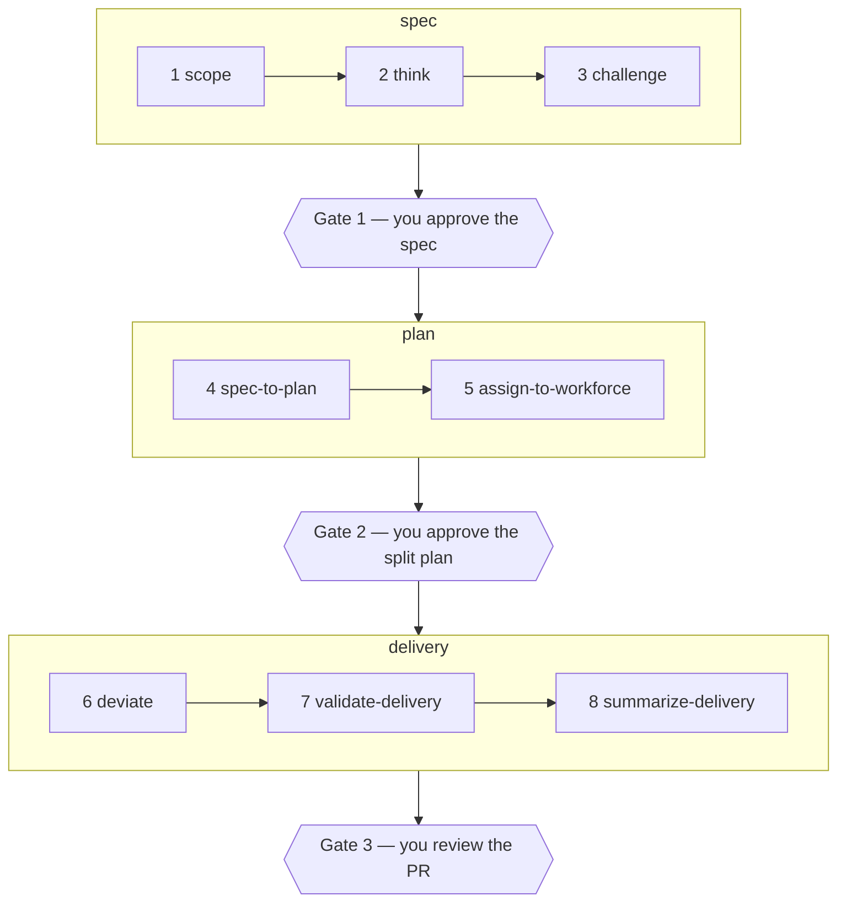

# devague

Devague is a CLI that helps you turn a vague idea into a spec, a plan, and
an accounted-for delivery. Your AI agent drives devague. You hold the three
gates.

## Install

```bash
uv tool install devague      # or: uvx devague / pipx install devague
devague --version
```

## Set up your agent

Tell your agent:

> Run `devague learn` and learn the eight devague skills.

- You instruct; the agent calls it. The command prints instructions written
  for the agent, not for you: the method, then how to create the skills.
- The agent writes the eight skill files, with your consent, into its own
  skills folder (Claude Code: `.claude/skills/`).
- It never overwrites a skill that already exists.

## Work with your agent

From here on you talk to the agent, one skill at a time, in this order:



1. **`/scope`** — the agent surveys what the idea touches and records each
   finding.
2. **`/think`** — the agent works backwards from the announcement into a
   spec; every proposal waits for your confirm; it exports once the frame
   converges.
3. **`/challenge`** — the agent hunts blind spots in the spec; findings come
   back to you as proposals.
4. **`/spec-to-plan`** — the agent turns the spec into tasks with acceptance
   criteria and a dependency order; you confirm the plan.
5. **`/assign-to-workforce`** — you approve the split; the agent fans tasks
   out to a workforce of agents, one worktree each, merges gated by tests.
6. **`/deviate`** — the run stops when it must leave the plan; you approve
   the departure; it is recorded.
7. **`/validate-delivery`** — the agent runs the behavioral tests and files
   evidence and deltas; failing stays failing.
8. **`/summarize-delivery`** — the agent writes the accountability artifact
   and opens the PR you review.

Three gates are yours: the spec, the split plan, the PR. Everything else is
the agent's, and all of it is written down.

At gate 3, give your reviewer a head start. A reviewing agent will not know
to look for devague's artifacts on its own, so tell it:

> Run `devague learn review` and follow it.

It prints instructions for a reviewer agent: audit the obligations,
evidence, deltas and lapses the run filed instead of re-deriving what should
have been tested. Paste it into the review request if the reviewer cannot run
commands.

## Why it works

- **Gates, not vibes.** A spec or plan exports only after it converges.
- **The agent never confirms itself.** Anything it proposes stays proposed
  until you confirm it.
- **Nothing is deleted to go green.** Unknowns are parked, questions are
  resolved, out-of-milestone targets are deferred, all on the record.
- **Ledgers are append-only and filed on the spot.** The agent documents a
  claim right as it happens, reducing the chance of mis-documentation due to
  attention drift. Deviations, evidence, behavior deltas and reasoning lapses
  are recorded the moment they happen, never reconstructed at the end.

What devague never does:

- **Call an LLM.** The CLI is deterministic and fully unit-tested.
- **Run a test.** Tests run agent-side; devague records the result.
- **Orchestrate agents.** It describes the dependency graph; the skill does
  the fan-out.

## What lands where

| Path | Written by | Git |
|------|-----------|-----|
| `.devague/frames/<slug>.json` | `/scope`, `/think`, `/challenge` | committed |
| `.devague/plans/<slug>.json` | `/spec-to-plan` | committed |
| `.devague/deliveries/<plan-slug>.json` | `/deviate`, `/validate-delivery` | committed |
| `.devague/reviews/`, `.devague/questions/` | review and decision working files | gitignored (devague adds the rule) |
| `docs/specs/<date>-<slug>.md` | `/think` export | committed — the spec |
| `docs/plans/<date>-<slug>.md` | `/spec-to-plan` export, `/assign-to-workforce` split | committed — the plan and split |
| `docs/deliveries/<date>-<slug>.md` | `/summarize-delivery` | committed — what actually shipped |
| `docs/current-spec.md` | `/summarize-delivery` (`devague today`) | committed — what the app does now |

See also:

- `docs/skills.md` — the eight skills in long form.
- `docs/spec-contract.md` — every record kind and move contract.
- `CLAUDE.md` — how this repo drives itself with devague.
